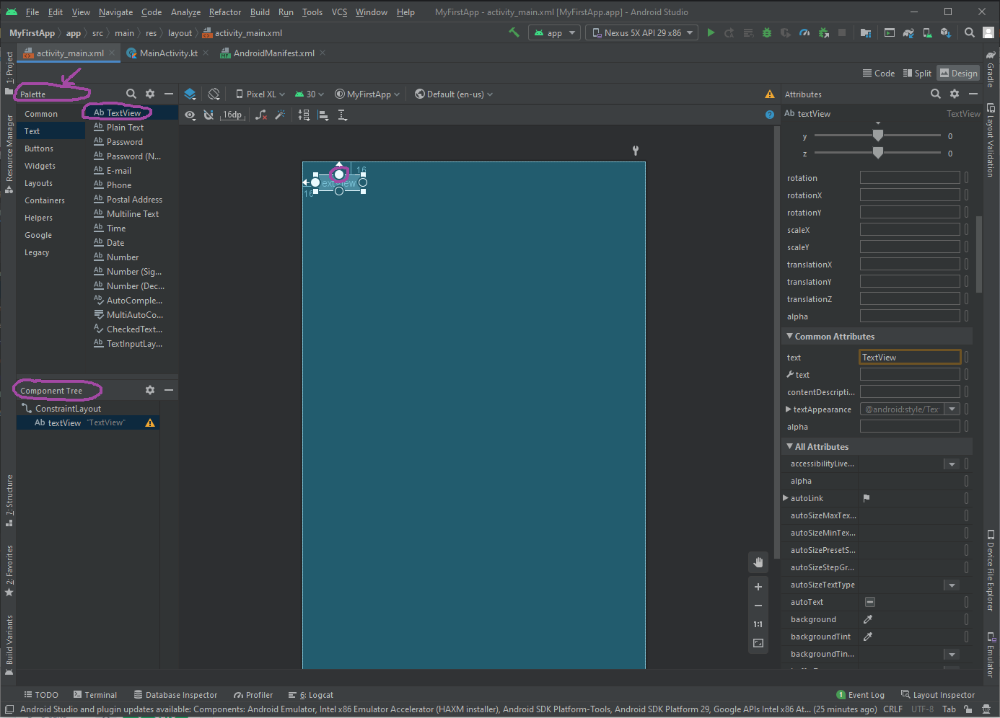
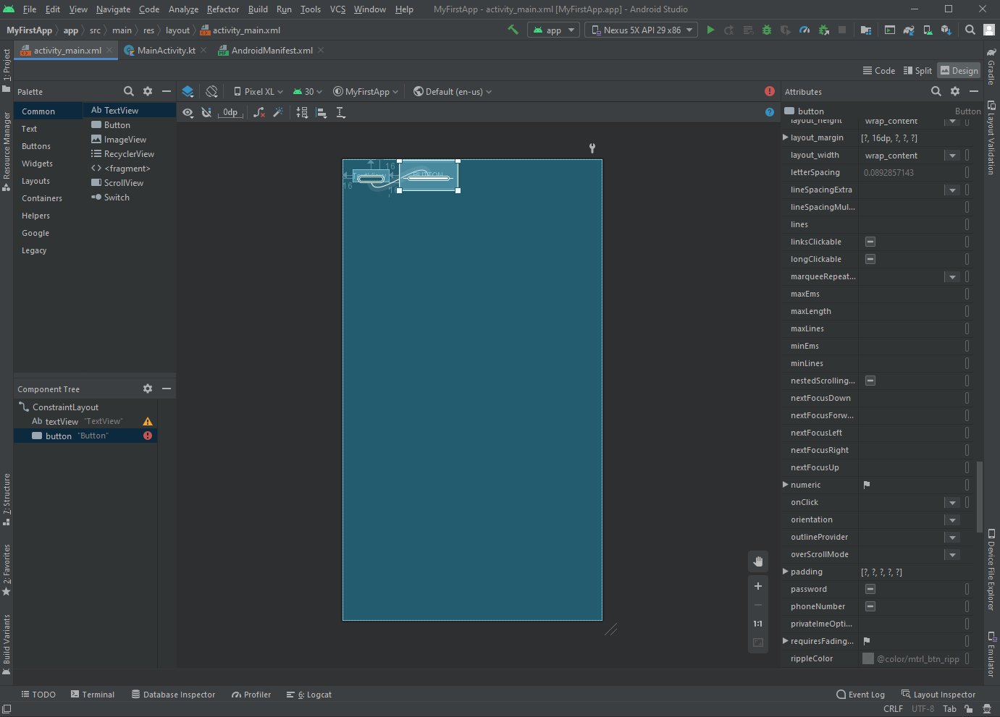
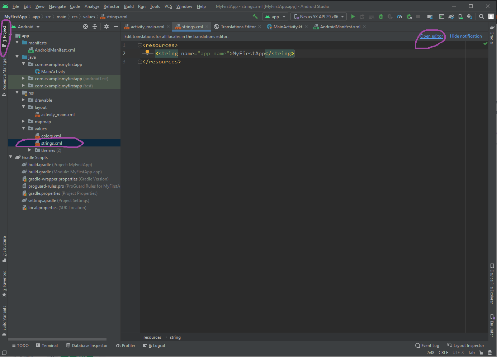

# УФ2. Верстка

Пользовательский интерфейс приложения Android представляет собой иерархию **макетов \(layouts\)** и **виджетов \(widgets\)**. **Макетами** в данном случае являются объекты под названием **ViewGroups**, которые являются **контейнерами**, которые контролируют как вложенные элементы позиционируют на экране. **Виджетами** называются объекты **View**, компоненты пользовательского интерфейса, такие как кнопки, поля ввода или текстовые поля.

Прописывать контейнеры ViewGroup и объекты View можно при помощи XML, однако Android Studio обладает графическим редактором, при помощи которого можно просто создать пользовательский интерфейс, используя Drag-and-drop \(перетаскивай и отпускай\).

### Настройка графического редактора

Для настройки графического редактора:

1. В окне проекта откройте **app &gt; res &gt; layout &gt; activity\_main.xml**.
2. Чтобы было больше места для окна графического редактора скройте структуру проекта. Для того чтобы сделать это, кликните по кнопке слева сверху **View &gt; Tool Windows &gt; Project**, или кликните по вертикальной кнопке **Project,** которая находится в левом краю экрана Android Studio .
3. Если редактор показывает исходный XML-код, то кликните по кнопке **Design**, которая находится в правом верхнем углу окна.
4. Кликните по  \(**Select Design Surface**\) и выберите **Blueprint**.
5. Кликните \(**View Options**\) и убедитесь, что активна опция **Show All Constraints**.
6. Убедитесь в том, что автоматическое подсоединение элементов выключено  \(**Enable Autoconnection to Parent**\).
7. Click  \(**Default Margins**\) и выберите **16**. Если необходимо, то вы можете настроить отступы для каждого **View** позже.
8. Кликните \(**Device for Preview**\) и выберите **5.5, 1440 × 2560, 560 dpi \(Pixel XL\)**.

В результате выполненных шагов мы настроили редактор для дальнейшей работы на основе макета под названием **ConstraintLayout,** который определяет позицию объекта **View** на основе создания ограничений \(constraints\) по отношению к другим объектам **View** и макету. Вы можете увидеть такие constraints, посмотрев на текстовый блок "Hello, World!" - у него есть 4 constraints, которые цепляются за каждую границу макета.

### Добавление текстового блока

Для добавление текстового блока необходимо:

1. Удалите имеющийся текстовый блок. Для этого кликните правой кнопкой мыши по **TextView** в **Component Tree** и выберите **Delete**.
2. На панели **Palette**, кликните **Text** чтобы показать возможные текстовые блоки.
3. Перетащите **Plain Text** в окно редактора и бросьте его вверху макета.
4. Кликните по брошенному **View** в окне редактора. Вы можете увидеть пустые точки на каждой из сторон выбранного объекта. Данные точки называются якорями.
5. Кликните и удерживайте якорь с верхней стороны брошенного **View,** тащите якорь к верхней стороне до тех пор, пока он не зацепится на верхнюю сторону макета, после этого отпустите. После этого точка станет заполненной. Только что вы создали constraint, его внешний отступ \(margin\) равен 16 dp, которые вы задали в предыдущем этапе.
6. Повторите **шаги 4,5** для создания ограничения с левой стороны View к левой стороне макета.

### Добавление кнопки

1. На панели **Palette**, кликните **Buttons**.
2. Перетащите элемент **Button** в редактор и бросьте с правой стороны.
3. Создайте constraint левой стороны кнопки для правой стороны текстового блока.
4. Для того чтобы выровнять текстовый блок и кнопку кликните правой кнопкой мыши по кнопке и выберите **Show Baseline**  . Кликните и удерживайте появившийся внутри кнопки якорь, и после проведите его к такому же якорю внутри текстового блока.

### Содержание текстового блока и кнопки

Для предпросмотра интерфейса, кликните  \(**Select Design Surface**\) и выберите **Design**. Обратите внимание на то, что значения текстового блока и кнопки заданы по-умолчанию.

Для того, чтобы изменить их значения необходимо сделать следующие шаги:

1. Откройте окно **Project** и после откройте файл strings.xml по следующему расположению **app &gt; res &gt; values &gt; strings.xml**.

   Это ресурс строк, который позволяет задавать текстовые строки, которые используются в пользовательском интерфейсе. Задавая строки таким образом можно легче ими управлять \(находить, обновлять, переводить\).

2. Кликните **Open editor** вверху окна. Это откроет **Translations Editor**, который предоставляет простой интерфейс для добавления и редактирования строк. Также помогает организовывать переведенные строки.
3. Кликните  \(**Add Key**\) для того, чтобы создать новую строку как "текст-подсказку" для текстового блока.

   В диалоговом окне **Add Key**, выполните следующие шаги:

   1. Введите "edit\_message" в поле **Key**.
   2. Введите "Введите сообщение" в поле **Default Value**.
   3. Кликните **OK**.

4. Добавьте еще одну строку для кнопки с ключом "button\_send" и значением "Отправить".

Теперь вы можете прикрепить эти ссылки для добавленных **View.** Для того чтобы вернуться к макету, кликните **activity\_main.xml** вверху. Выполните следующие шаги:

1. Кликните по текстовому блоку в макете. Если окно **Attributes** еще не видно, то выберите его в правом краю окна приложения.
2. Найдите свойство **text**, которое в данный момент обладает значением "TextView" и удалите значение свойства.
3. Найдите свойство **hint** и кликните  \(**Pick a Resource**\), которое находится справа от поля, где нужно вводить свойство. В появившемся окне дважды кликните по значению **edit\_message**.
4. Выберите на макете кнопку, найдите свойство **text**, которое в данный момент имеет значение "Button." После, кликните  \(**Pick a Resource**\) и выберите при помощи двойного клика  **button\_send**.

### Гибкие размеры элементов

Для создания макета, который будет подстраиваться к разным размерам экранов, необходимо чтобы текстовый блок занимал все горизонтальное место, которое остается после кнопки и внешних отступов.

Прежде чем продолжить, переключитесь на режим плана, кликнув  \(**Select Design Surface**\) .

Для того, чтобы текстовый блок был более гибким:

1. Выберите оба объекта View. Для того, чтобы сделать это, выберите любой объект, зажмите клавишу Shift и выберите другой объект. Отпустите Shift и после этого кликните правой кнопкой мыши по любому View и выберите **Chains &gt; Create Horizontal Chain**.

   Вы создадите цепочку, которая является ограничителем между двумя и более объектами, которая позволяет объектам размещаться сообща, выравнивания объекты.

2. Выберите кнопку и откройте окно **Attributes**, используйте **Constraint Widget** чтобы выставить внешний отступ кнопки в 16 dp.
3. Выберите текстовый блок и просмотрите его атрибуты. И в меню **Constraint Widget** дважды кликните по индикатору ширины, чтобы он принял зазубренный вид. Таким образом объект View будет заполнять доступное пространство. Куда кликнуть вы можете увидеть на Рис.6.

\*\*\*\*

\*\*\*\*

