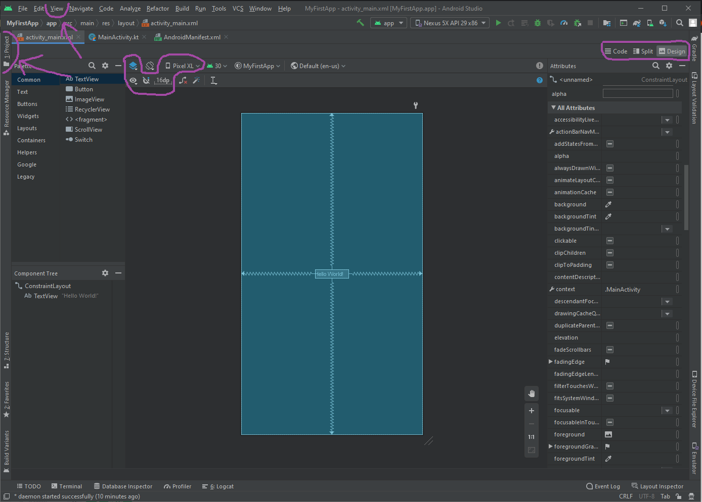

# УФ2. Верстка

### Настройка графического редактора

Для настройки графического редактора:

1. В окне проекта откройте **app &gt; res &gt; layout &gt; activity\_main.xml**.
2. Чтобы было больше места для окна графического редактора скройте структуру проекта. Для того чтобы сделать это, кликните по кнопке слева сверху **View &gt; Tool Windows &gt; Project**, или кликните по вертикальной кнопке **Project,** которая находится в левом краю экрана Android Studio .
3. Если редактор показывает исходный XML-код, то кликните по кнопке **Design**, которая находится в правом верхнем углу окна.
4. Кликните по  \(**Select Design Surface**\) и выберите **Design + Blueprint**.
5. Кликните \(**View Options**\) и убедитесь, что активна опция **Show All Constraints**.
6. Убедитесь в том, что автоматическое подсоединение элементов выключено  \(**Enable Autoconnection to Parent**\).
7. Click  \(**Default Margins**\) и выберите **16**. Если необходимо, то вы можете настроить отступы для каждого **View** позже.

В результате выполненных шагов мы настроили редактор для дальнейшей работы на основе макета под названием **ConstraintLayout,** который определяет позицию объекта **View** на основе создания ограничений \(constraints\) по отношению к другим объектам **View** и макету. Вы можете увидеть такие constraints, посмотрев на текстовый блок "Hello, World!" - у него есть 4 constraints, которые цепляются за каждую границу макета.

### Создание интерфейса

1. В приложении будет 2 Activity - MainActivity и SimpleCalculator. В MainActivity будет меню выбора вида калькулятора. В SimpleCalculator будет вид простого калькулятора который будет содержать:
   1. 2 текстовых поля;
   2. 10 кнопок с цифрами;
   3. 6 кнопок с операциями \(плюс, минус, умножение, деление и удаление\)
2. Сверху располагается текстовое поле вывода значения вычислений. Ниже располагается текстовое поле вывода значений, которые были активированы по кнопке. Ниже этого поля располагаются кнопки.
3. Кнопки располагаются таким образом, чтобы было примерно 4 кнопки в ряду.
4. Объектам необходимо присвоить ID, соответствующие их назначению и текстовое значение, создав для каждого объекта строку в файле strings.
5. Для аккаратного расположения кнопок создается 4 контейнера LinearLayout с горизонтальным расположением.
6. Текстовые поля по ширине должны быть равны match\_constraint.
7. Кнопки по высоте и ширине должны wrap\_content.
8. LinearLayout по высоте и ширине должны быть wrap\_content.

