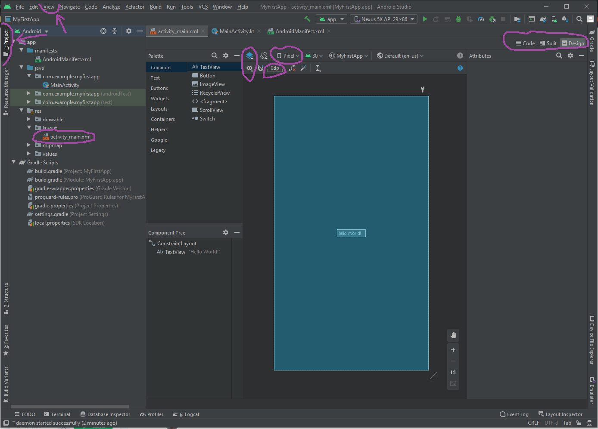

# УФ2. Верстка

Пользовательский интерфейс приложения Android представляет собой иерархию **макетов \(layouts\)** и **виджетов \(widgets\)**. **Макетами** в данном случае являются объекты под названием **ViewGroups**, которые являются **контейнерами**, которые контролируют как вложенные элементы позиционируют на экране. **Виджетами** называются объекты **View**, компоненты пользовательского интерфейса, такие как кнопки, поля ввода или текстовые поля.

Прописывать контейнеры ViewGroup и объекты View можно при помощи XML, однако Android Studio обладает графическим редактором, при помощи которого можно просто создать пользовательский интерфейс, используя Drag-and-drop \(перетаскивай и отпускай\).

### Открытие графического редактора

To get started, set up your workspace as follows:

1. В окне проекта откройте **app &gt; res &gt; layout &gt; activity\_main.xml**.
2. Чтобы было больше места для окна графического редактора скройте структуру проекта. Для того чтобы сделать это, кликните по кнопке слева сверху **View &gt; Tool Windows &gt; Project**, или кликните по вертикальной кнопке **Project,** которая находится в левом краю экрана Android Studio .
3. If your editor shows the XML source, click the **Design** tab at the top right of the window.
4. Click  \(**Select Design Surface**\) and select **Blueprint**.
5. Click  \(**View Options**\) in the Layout Editor toolbar and make sure that **Show All Constraints** is checked.
6. Make sure Autoconnect is off. A tooltip in the toolbar displays  \(**Enable Autoconnection to Parent**\) when Autoconnect is off.
7. Click  \(**Default Margins**\) in the toolbar and select **16**. If needed, you can adjust the margins for each view later.
8. Click  \(**Device for Preview**\) in the toolbar and select **5.5, 1440 × 2560, 560 dpi \(Pixel XL\)**.

