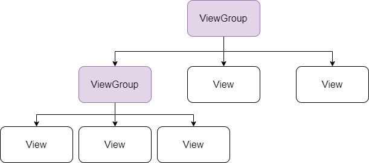

# Модуль 2. Верстка

Пользовательский интерфейс приложения Android представляет собой иерархию **макетов \(layouts\)** и **виджетов \(widgets\)**. **Макетами** в данном случае являются объекты под названием **ViewGroups**, которые являются **контейнерами**, которые контролируют как вложенные элементы позиционируют на экране. **Виджетами** называются объекты **View**, компоненты пользовательского интерфейса, такие как кнопки, поля ввода или текстовые поля.

