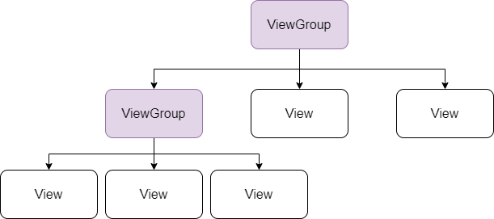
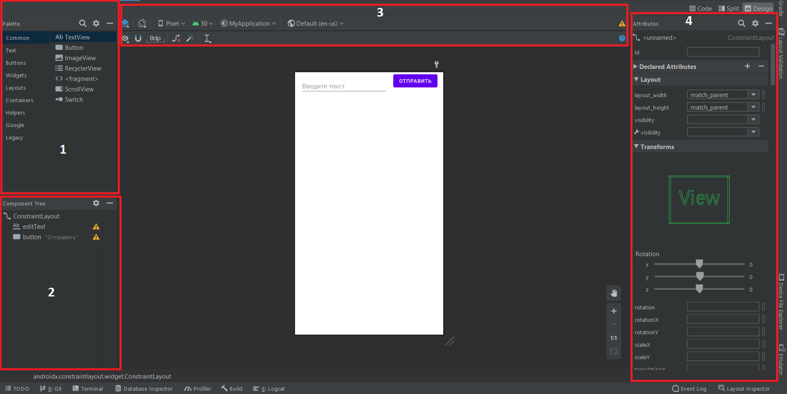

# УФ1. View и ViewGroup

Пользовательский интерфейс приложения Android представляет собой иерархию **макетов \(layouts\)** и **виджетов \(widgets\)**. **Макетами** в данном случае являются объекты под названием **ViewGroups**, которые являются **контейнерами**, которые контролируют как вложенные элементы позиционируют на экране. **Виджетами** называются объекты **View**, компоненты пользовательского интерфейса, такие как кнопки, поля ввода или текстовые поля.

Прописывать контейнеры ViewGroup и объекты View можно при помощи XML, однако Android Studio обладает графическим редактором, при помощи которого можно просто создать пользовательский интерфейс, используя Drag-and-drop \(перетаскивай и отпускай\).

## Использование View

View представляет собой базовый компонент пользовательского интерфейса, при помощи которого пользователь взаимодействует с приложением. Большинство таких элементов, как кнопка или текстовое поле наследуются от класса View.

При создании проекта у нас создается файл `MainActivity` и `main_activity.xml`. Это два взаимосвязанных файла, которые определяют один экран. В коде файла `MainActivity` через фукнцию `setContentView` файл макета `activity_main` назначается в качестве интерфейса.



```kotlin
class MainActivity : AppCompatActivity() {
    override fun onCreate(savedInstanceState: Bundle?) {
        super.onCreate(savedInstanceState)
        setContentView(R.layout.activity_main)
    }
}
```



Интерфейс представляет собой дерево объектов View, которые находятся во ViewGroup.



В основном с объектами View можно делать следующие действия:

* устанавливать свойства. Например, задавать текст компоненту TextView;
* устанавливать фокус на конкретном View;
* устанавливать слушателей, которые будут оповещать, если что-то происходит с системой, например была нажата кнопка;
* устанавливать видимость объекта.

Объекты View можно определять 3 способами, в коде Java/Kotlin, в коде xml, в графическом редакторе.

## Создание объектов View через графический редактор

Ниже можно ознакомится с рис. 2 и легендой для знакомства с графическим редактором:

1. Palette - меню для выбора объектов. Здесь можно найти разные объекты для создания интерфейса. Для выбора и расположения объекта на экране используется Drag-and - нужно выбрать его правой кнопкой мыши, зажать правую кнопку мыши и бросить на экране.
2. Component Tree - в этом меню будет видна иерархия объектов и отображаться сообщения с предупреждениями и ошибками в случае, если с компонентами что-то не так.
3. Панель управления - здесь можно выбирать режим просмотра экрана, формат экрана, модель смартфона, настраивать видимость отступов, ограничений и т.д., отступы по умолчанию, автовыравнивание.
4. Attributes - в данном меню можно настраивать такие атрибуты выбраного объекта, как ширина, высота, отступы, цвет, текст, шрифт, цвет текста.



## Создание объектов View с помощью xml

На примере activity\_message.xml из прошлого модуля продемонстрируем работу с xml-файлос

```markup
<?xml version="1.0" encoding="utf-8"?>
<androidx.constraintlayout.widget.ConstraintLayout
    xmlns:android="http://schemas.android.com/apk/res/android"
    xmlns:app="http://schemas.android.com/apk/res-auto"
    xmlns:tools="http://schemas.android.com/tools"
    android:layout_width="match_parent"
    android:layout_height="match_parent"
    tools:context=".MessageActivity">

    <TextView
        android:id="@+id/messageText"
        android:layout_width="wrap_content"
        android:layout_height="wrap_content"
        android:text="Hello World!"
        android:textSize="18sp"
        app:layout_constraintBottom_toBottomOf="parent"
        app:layout_constraintLeft_toLeftOf="parent"
        app:layout_constraintRight_toRightOf="parent"
        app:layout_constraintTop_toTopOf="parent" />

</androidx.constraintlayout.widget.ConstraintLayout>
```

Первая строчка `<?xml version="1.0" encoding="utf-8"?>` означает, что мы работает с файлом xml. Данная строка не является обязательной, однако крайне рекомендуется её присутствие, так как она говорит о том, с какой версией xml идет работа и в какой кодировке. 

Тег `<androidx.constraintlayout.widget.ConstraintLayout` означает что мы работаем с макетом вида `ConstraintLayout`, в самом конце находится закрывающий тег.

Строки, которые начинаются на `xmlns` с приставками `app`, `android`, `tools` означают с какими ресурсами мы работаем и указывают их месторасположение. Данные ресурсы предоставляют разработчику доступ к, например, тегам и атрибутам которые мы можем использовать для создания интерфейса.

После этого настраивается ширина и высота макета и происходит переход к объявлению объектов интерфейса. У каждого объекта объявляется собственный тег, например `TextView`.

## Контроль



