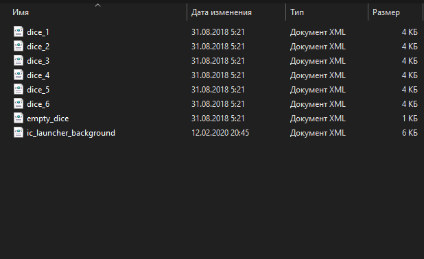
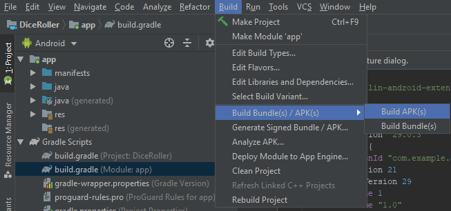

# Android Studio

Лабораторная работа № 3

Разработка мобильных приложений

**Цель работы**: в среде разработки Android Studio создать приложение, по генерации случайного числа

**Порядок выполнения работы:**

1. **Установка среды**

Скачать установочный файл Android Studio вы сможете, перейдя по этому сайту: [https://developer.android.com/studio/](https://developer.android.com/studio/)

Необходимая версия Android Studio выберется автоматически, однако если что-то пошло не так, то вы можете выбрать **Download options** и выбрать необходимую версию для вашей ОС самостоятельно.

1. **Генерация приложения**

После установки приложения выберите в меню «Start a new Android Studio project.

Вам будет предложены несколько шаблонов для создания проекта – выберите Empty Activity, или пустой шаблон.

В окне конфигурирования проекта выберите имя проекта, место сохранения, язык и минимально допустимый уровень API. Место сохранения должно быть прописано исключительно латиницей, без использования специальных символов или кириллицы.

В качестве рекомендуемых параметров можно использовать следующие:

* Имя – DiceRoller, т.к. проект будет посвящен генерации случайных чисел и для красочности будут использованы изображения разных граней игральной кости
* Язык программирования – Kotlin, т.к. он является официальным для разработки Android-приложений
* Минимальный уровень API – API 19, т.к. эта версия Android поддерживается на большинстве устройств

Когда вы кликните по кнопке Finish ваш проект какое-то время будет генерироваться. Генерация проекта завершиться словами Build completed successfully в нижней части экрана. Также после завершения генерации проекта у вас откроются два файла – **activity\_main.xml** и **MainActivity.kt**.

Когда проект сгенерируется, он будет представлен в таком виде. С анатомией сгенерированного проекта вы можете ознакомиться в файле с лекциями, который расположен по данной ссылке: [https://drive.google.com/drive/u/1/folders/1hbBgMLEyp3hZ22yVjKdSYeITrun8D5uu?authuser=1](https://drive.google.com/drive/u/1/folders/1hbBgMLEyp3hZ22yVjKdSYeITrun8D5uu?authuser=1)

1. **Создание макета**

Кликните на текст по середине макета. Вы увидите, что стрелочками он притянут к краям «экрана». Вы можете удалить его, в данном проекте он не понадобиться.

Скачайте архив DiceImages.zip и переместите их в папку с вашим проектом: **«&lt;Путь к проекту&gt;\app\src\main\res\drawable»**

Примерно так должна выглядеть папка после того, как вы переместите изображения

Обратите внимание на то, что сами изображения граней не в привычных форматах, но в XML. Данный изображения являются векторными.

Выберите в меню **ImageView** и разместите его в любом месте макета, если вы его специально «кините» не на середину, то будет даже лучше. После вам предложат выбрать отображаемое изображение для выбранного объекта – вам нужно выбрать **EmptyDice** \(см. скриншоты ниже\).

Выберите созданный объект. Обратите внимание, что на каждой стороне у него присутствуют точки. Зажмите каждую точку и поведите её к соответствующему краю \(точку вверху изображения к верхнему края экрана и т.д.\).

Сделав это, вы создадите **Constraint** – ограничение, того, как должен вписаться объект на экран. Это возможно, потому что по умолчанию используется так называемый **ConstraintLayout** – его рекомендуется использовать для немного количества объектов или групп объектов.

Теперь необходимо вставить кнопку **\(Button\),** при нажатии на которую будет генерироваться новое число. Данную кнопку необходимо ограничить по тому же принципу, что и **ImageView**, однако верхнюю сторону кнопки необходимо привязать к нижней сторону картинки. Таким образом, кнопка впишется по середине между нижней границей изображения и нижней границей экрана. Вы можете регулировать местоположение каждого подобного объекта регуляторами в окне Attributes.

У каждого генерируемого есть **id** – он формируется при создании объекта на макете. Найти его можно в самом верху окна **Attributes**.

1. **Создание обработчика**

На этом макет можно считать завершенным, остается только написать обработчик для кнопки. Для этого перейдите в файл **MainActivity.kt**

Код обработчика должен быть такой же, как на скриншоте. Сам код не предоставлен в целях привыкания к некоторым особенностям языка Kotlin и работы с библиотекой Anroid.

Когда вы завершите писать обработчик вам необходимо перейти во вкладку **Gradle -&gt; build.gradle \(Module:app\)** и вставить строчку **vectorDrawables.useSupportLibrary = true**. Это позволит приложению работать с векторными изображениями.

1. **Дебаг готового приложения**

Протестировать приложение вы сможете либо при помощи эмулятора, либо при помощи установки на свое Android-устройство.

Для работы с эмулятором вам необходимо:

1. Открыть **ADV Manager**
2. Выбрать создание виртуального устройства
3. Выбрать необходимое устройство
4. Выбрать версию Android и скачать её, если необходимо
5. Проверить конфигурацию и завершить создание

Для тестирования на своем Android-устройстве вам необходимо активировать режим разработчика, как это сделать вы можете прочитать на данном сайте: [https://androidmir.org/android/4901/](https://androidmir.org/android/4901/)

После активации режима разработчика вам потребуется разрешить отладку по USB и установку приложений по USB. Далее вам будет необходимо подсоединить через USB-порт ваше Android-устройство и подождать пока пройдет настройка. Устройство будет доступно в верхнем правом меню.

**6. Публикация приложения**

В силу определенных ограничений, мы не можем полноценно работать с магазином приложений Google Play, однако мы можем сформировать apk файл. Для этого необходимо выбрать в меню кнопку **Build -&gt; Build Bundle\(s\)/APK\(s\) -&gt; Build APK.**

Созданный apk файл вы сможете найти, если кликните по ссылку locate, которая будет расположена во всплывшем окне, которое появится после создания билда.

